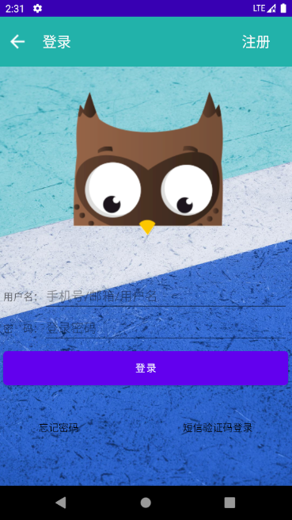
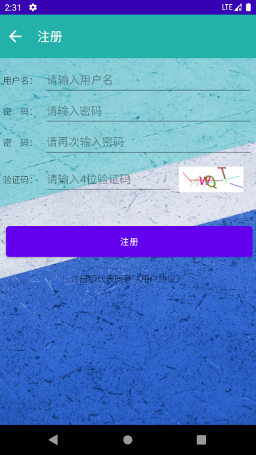
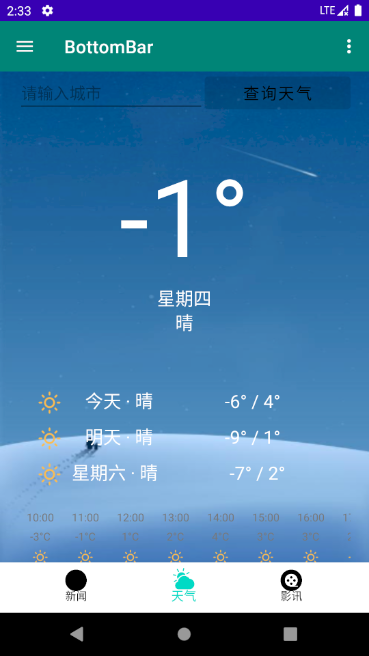
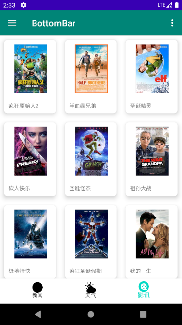
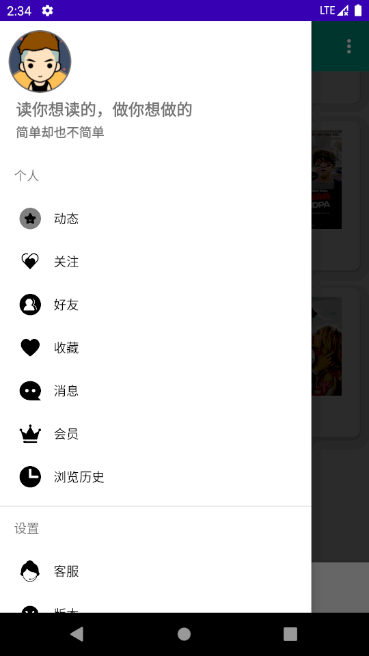
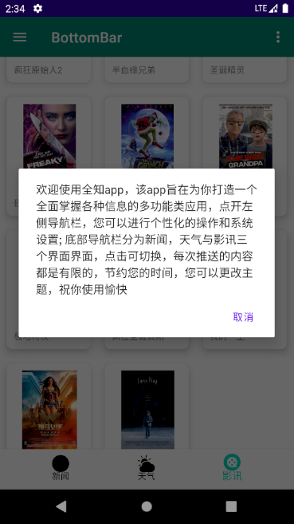

# Eye
基于 [Kotlin](https://kotlinlang.org) 语言写的 Eve App是Android 客户端项目。

## 简介
Eve app，该app旨在为用户打造一个全面掌握各种信息的多功能类应用，点开左侧导航栏，您可以进行个性化的操作和系统设置;底部导航栏分为新闻，天气与影讯三个界面界面，点击可切换，每次推送的内容都是有限的，节约用户的时间; 同时这款 App 的界面设计着重简洁清新。希望通过此项目，进行相关技术的学习与整合。

## 技术介绍
- 登录界面
  - 技术
- 操作界面
  - 底部导航栏采用 Navigation+Fragment 布局
  - 新闻界面
    - 整体采用 RecyclerView 线性布局
    - 使用 cardview glid 优化
    - 使用 SwipereFreshLayout完成刷新
    - 使用 mysqlite 存储数据，实现无网络时的加载
  - 天气界面
    - 使用 Recyclerview 及 blurkit 优化
  - 影讯
    - 使用 Recyclerview 九宫格布局
    - 使用 cardview 优化 item
- 侧边栏
  - DrawerLayout NavigationView 实现侧边栏
  - Toolbar  CoordinatorLayout 实现顶部导航栏 
  ## 屏幕截图

  

## 下载体验

- [点击下载 EveTg.apk](https://raw.githubusercontent.com/zhsss/EverythingApp/master/Eve.apk)

## 主要功能
- 观看优质新闻。
- 实时浏览全国各地天气。
- 浏览最新电影影讯。
- 分享精彩短视频与新鲜资讯等。

## 使用工具
- [json-to-kotlin](https://www.demojameson.com/2017/05/29/convert-json-to-kotlin-data-class/) json转换

## api
- [聚合](https://www.juhe.cn/) 新闻
- [极速](https://www.jisuapi.com/) 天气
- [豆瓣](https://www.jianshu.com/p/a7e51129b042) 影讯

## 第三方库
- [Retrofit](https://github.com/square/retrofit) 网络请求框架封装
- [Glide](https://github.com/bumptech/glide) 图片加载
- [Gson](https://github.com/google/gson) Gson 解析
- [SwipereFreshLayout](https://github.com/hanks-zyh/SwipeRefreshLayout) 下拉刷新
- [bottom-navigation-bar](https://github.com/RoyWallace/BottomNavigationBar) 底部导航栏
- [blurkit](https://github.com/CameraKit/blurkit-android) 模糊
- [circleimageview](https://github.com/hdodenhof/CircleImageView) 图像
- [constraintlayout](https://github.com/android/views-widgets-samples/tree/master/ConstraintLayoutExamples) 约束
- [cardview](https://github.com/chiemy/CardView) 卡片
